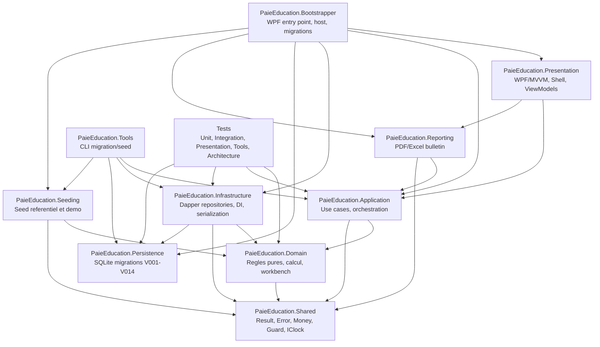
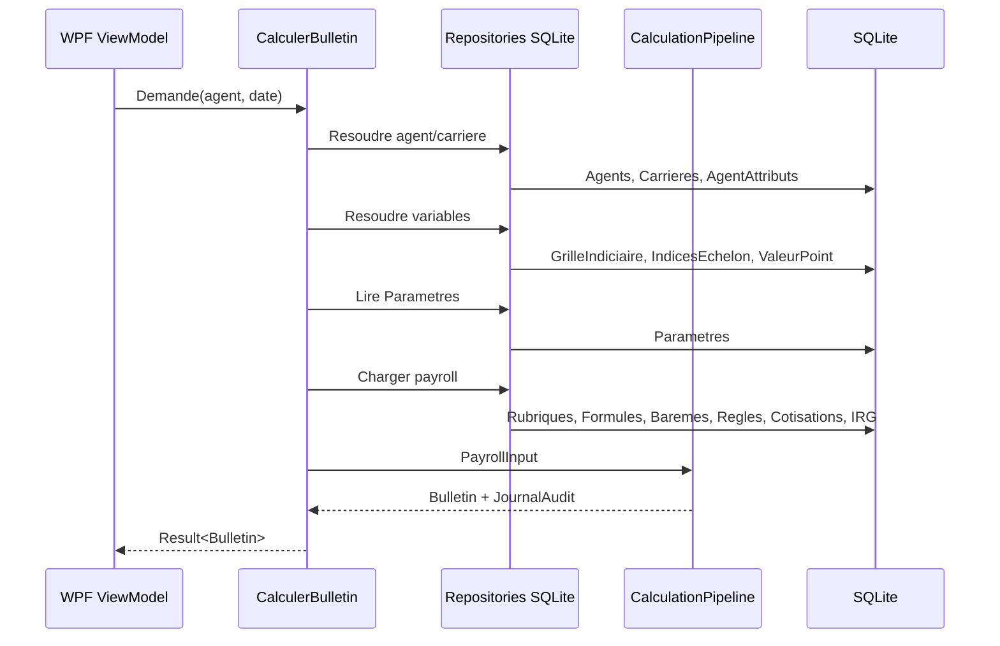
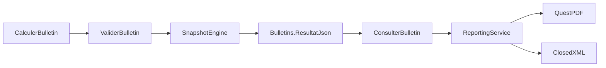

# Documentation technique de reference - PaieEducation ERP

> Audit realise le 18/07/2026. Perimetre: lecture du depot, execution non destructive de `dotnet test PaieEducation.slnx -c Debug --no-restore`, production documentaire uniquement. Aucun fichier de code n'a ete modifie.

## 1. Resume executif

PaieEducation ERP est une application desktop WPF mono-utilisateur de paie pour les etablissements publics de l'education nationale algerienne. Le code observe cible .NET 10 (`global.json`, `PaieEducation.slnx`, `Directory.Build.props`) et suit une Clean Architecture: `Domain`, `Application`, `Infrastructure`, `Persistence`, `Presentation`, `Reporting`, `Shared`, `Bootstrapper`, `Seeding`, `Tools` et projets de tests.

Le plan d'action officiel existe et a ete localise avant l'audit: `docs/PLAN_ACTION.md`. Il est cite par `README.md:37` et structure le projet en phases 0 a 10 (`docs/PLAN_ACTION.md:96-109`). Les tomes de specification V4.0 sont egalement presents sous `Documentation de Référence du Projet/Version 4.0/`, notamment architecture, domaine, moteur de paie, persistance, presentation et reporting.

Etat global prouve: la base technique est solide, les migrations V001 a V014 couvrent deja une grande partie du referentiel, le moteur de calcul est fonctionnel sur le pilote, les use cases applicatifs principaux existent et la suite de tests passe integralement. Verification executee: `dotnet test PaieEducation.slnx -c Debug --no-restore` => 470 tests verts: Unit 152, Presentation 34, Tools 47, Architecture 3, Integration 234.

Etat global par rapport au plan officiel: phases 0 a 3 largement realisees; phases 3bis, 4, 5 et 6 avancees mais partielles; phase 7 limitee au bulletin PDF/Excel; phase 8 partielle; phases 9 et 10 non implementees. Les principaux ecarts sont le simulateur d'evolution encore placeholder, des sources de valeur non resolues, l'UI Workbench incomplete, la validation reglementaire sans bulletins reels, et le deploiement non traite.

Point d'attention transversal: le principe "zero hardcoding" est respecte dans le moteur runtime pour les parametres critiques lus en base (`CalculerBulletin.cs:88-131`, `ParametreSystemeRepository.cs:22-82`, `PayrollReadRepository.cs:67-163`). En revanche, de nombreuses valeurs reglementaires de seed sont encore embarquees dans des seeders C# (`IrgSeeder.cs:102-170`, `FormulesSeeder.cs:64-68`, `ReglementaireSeeder.cs:508-640`). C'est acceptable pour reconstruire une base hors production, mais cela reste une dette vis-a-vis de l'exigence stricte "configuration pilotee par base / aucune valeur codee en dur".

## 2. Vue d'ensemble de l'architecture

Preuves structurelles:

| Element | Preuves |
|---|---|
| Solution | `PaieEducation.slnx` liste 8 projets `src`, 5 projets `tests`, 1 projet `tools`; le projet physique `src/PaieEducation.Seeding` est reference par Bootstrapper/Tools/Tests mais absent comme entree directe de `PaieEducation.slnx`. |
| .NET 10 | `global.json` fixe SDK `10.0.301`; les projets ciblent `net10.0` ou `net10.0-windows` (`rg <TargetFramework>`). |
| Clean Architecture | References projets dans les `.csproj`; garde-fous dans `tests/PaieEducation.Tests.Architecture/DependencyRulesTests.cs:7-47`. |
| Composition root | `src/PaieEducation.Bootstrapper/App.xaml.cs:34-42` cree le host et cable Application, Infrastructure, Presentation, Reporting; `App.xaml.cs:97-99` charge les migrations. |
| DI applicative | `ApplicationServiceCollectionExtensions.cs:17-42`, `InfrastructureServiceCollectionExtensions.cs:26-73`, `PresentationServiceCollectionExtensions.cs:19-36`, `ReportingServiceCollectionExtensions.cs:13-18`. |

## 3. Inventaire des modules, composants et services

| Module | Responsabilite | Fichiers cles | Etat |
|---|---|---|---|
| Shared | Result/Error, Money, Guard, IClock | `src/PaieEducation.Shared/Results/Result.cs`, `Error.cs`, `Money/Money.cs`, `Time/IClock.cs` | Realise |
| Domain.Calcul | Formules, IRG, cotisations, pipeline, validation, snapshot, rappels | `CalculationPipeline.cs:21-158`, `FormulaEvaluator.cs:12-149`, `IrgCalculator.cs:24-116`, `RappelCalculator.cs` | Avance, partiel sur certaines sources |
| Domain.Workbench | Eligibilite DNF, baremes, sources valeur, value objects | `RegleEligibiliteEvaluator.cs:27-260`, `BaremeResolver.cs`, `SourceValeurCalculators.cs:7-93` | Partiel: deux calculateurs non resolus |
| Application.Payroll | Calcul, validation, consultation bulletin, resolution entrees | `CalculerBulletin.cs:25-143`, `ValiderBulletin.cs`, `ConsulterBulletin.cs`, `CalculEntreeResolver.cs:26-84` | Realise sur pilote |
| Application.Referentiels | Valeur du point, grille, rubrique, formule, parametre | `DefinirValeurPoint.cs`, `DefinirRubrique.cs`, `DefinirFormuleRubrique.cs`, `DefinirParametreRubrique.cs` | Realise, UI partielle |
| Application.Workbench | Suggestions, affectations, audit, matrice, rappels, evolution | `SuggererRubriques.cs`, `ListerMatriceCouverture.cs`, `GenererRappels.cs`, `AppliquerEvolutionReglementaire.cs`, `SimulerEvolutionReglementaire.cs:21-97` | Partiel: simulation placeholder |
| Infrastructure | Repositories SQLite/Dapper, UoW, serialization, DI | `Repositories/Payroll/*`, `Repositories/Workbench/*`, `Persistence/DapperUnitOfWork.cs`, `Serialization/*` | Avance |
| Persistence | Migrations SQL embarquees | `src/PaieEducation.Persistence/Migrations/V001__init.sql` a `V014__types_sexe_situations.sql`; `SqliteMigrator.cs:35-186` | Realise, schema en evolution |
| Seeding | Referentiel initial, IRG, formules, nomenclature, agent demo | `src/PaieEducation.Seeding/Seeding/*.cs`, `DatabaseSeeder.cs`, `DemoAgentSeeder.cs` | Realise, dette d'externalisation |
| Presentation | Shell WPF, ecrans paie, agents, referentiels, Workbench | `ShellViewModel.cs:27-61`, `CalculerBulletinViewModel.cs:30-160`, `EditerRubriqueViewModel.cs:34-168` | Partiel |
| Reporting | Rendu bulletin PDF/Excel depuis snapshot | `BulletinPdfRenderer.cs:11-131`, `BulletinExcelExporter.cs:7-132`, `ExporterBulletin.cs` | Partiel |
| Tools | CLI migration/seed | `tools/PaieEducation.Tools/Cli.cs`, `Program.cs` | Realise |
| Tests | Unitaires, integration SQLite, presentation, architecture, tools | `tests/**` | 470 verts |

## 4. Cartographie plan d'action -> implementation

Source officielle: `docs/PLAN_ACTION.md`.

| Phase | Description | Statut reel | Preuves | Taux estime | Ecarts |
|---|---|---:|---|---:|---|
| 0 | Cadrage, solution, conventions, SDK, tests smoke | Terminee avec reserve | `global.json`, `PaieEducation.slnx`, `Directory.Build.props`, `DependencyRulesTests.cs:22-47`, tests verts | 90% | `PaieEducation.Seeding` absent de `PaieEducation.slnx` comme projet direct; scripts build/test non observes. |
| 1 | Referentiel parametrable SQLite | Terminee / evolutive | Migrations `V001` a `V014`; tables `Rubriques`, `ValeurPoint`, `IRGReglesPeriode`, `Agents`, `Bulletins`, `Rappels`; tests schema | 85% | Quelques `CHECK IN` restent des enumerations SQL; normal en SQLite mais a surveiller face au "pilotage base". |
| 2 | Ingestion et seed donnees reference | Partielle | `NomenclatureSeeder.cs`, `IrgSeeder.cs`, `ReglementaireSeeder.cs`, `CsvCascadeParser.cs`, tests Tools 47 | 70% | Valeurs reglementaires embarquees en C#; pas d'import PDF/Excel generalise prouve; externalisation a renforcer. |
| 3 | Domaine DDD | Largement terminee | `Domain/Calcul/*`, `Domain/Workbench/*`, tests unitaires 152 | 85% | Sources valeur `INDICE_ECHELON` et `CONSTANTE_REGLEMENTAIRE` non resolues (`SourceValeurCalculators.cs:58`, `:93`). |
| 3bis | Workbench reglementaire modele V009 + services | Partielle | `V009__workbench_reglementaire.sql:38-142`, `RegleEligibiliteEvaluator.cs:52-177`, `ListerMatriceCouverture.cs:27-96` | 70% | `SimulerEvolutionReglementaire` reste placeholder (`SimulerEvolutionReglementaire.cs:21`, `:97`). |
| 4 | Moteur de paie pilote enseignants | Partielle avancee | `CalculationPipeline.cs:38-158`, `PayrollReadRepository.cs:67-163`, `IrgCalculator.cs:39-116`, tests `CalculerBulletinTests`, `BulletinEndToEndTests` | 75% | Pas de validation sur bulletins reels; dependances entre rubriques non chargees dans le pipeline (`Array.Empty<DependanceArete>()` dans `CalculationPipeline.cs:42-44`). |
| 5 | Application & Persistence | Partielle avancee | Use cases DI `ApplicationServiceCollectionExtensions.cs:19-42`; repositories DI `InfrastructureServiceCollectionExtensions.cs:44-61`; tests integration 234 | 80% | UoW limite; actor fourni par appelant; pas de UserContext; quelques controles FK differes (`CreerAgent.cs` commentaire hors perimetre). |
| 6 | Presentation WPF/MVVM | Partielle | Shell/navigation `ShellViewModel.cs:27-61`; ecrans calcul/validation/consultation/agent/grille/workbench; tests Presentation 34 | 60% | FormulaEditor, editeur bareme, editeur DNF, assistant evolution, matrice pivot couleur et filtres reels manquants. |
| 7 | Reporting documents | Partielle | `BulletinPdfRenderer.cs`, `BulletinExcelExporter.cs`, `ReportingService.cs`, `ExporterBulletin.cs` | 40% | Seulement bulletin PDF/Excel; attestations, etats recap, ordre virement, rapport impact PDF non observes. |
| 8 | Qualite et validation reglementaire | Partielle | 470 tests verts, `dotnet test` execute; nombreux tests schema/calcul/workbench | 50% | Pas de couverture mesuree, pas de tests perf, pas de comparaison bulletins reels, pas de non-regression visuelle. |
| 9 | Deploiement, documentation finale | Non implementee | Aucun installeur/packaging observe; `README.md` commandes locales | 10% | Sauvegarde/restauration, initialisation utilisateur, manuel exploitation a produire. |
| 10 | Extension autres corps | Non implementee | Plan seulement `docs/PLAN_ACTION.md:828-829` | 5% | A mener apres validation pilote. |

## 5. Fonctionnalites implementees par domaine

### Referentiel et donnees

- Migrations SQLite rejouables avec table `SchemaVersions`: `SqliteMigrator.cs:55-70`, `EnsureSchemaVersionsTable` `SqliteMigrator.cs:143-186`; tests idempotence et WAL dans `MigratorTests.cs:46-176`.
- Nomenclature organique: `V002__nomenclature.sql:24-123` cree filieres, contrats, personnels, fonctions, echelons, categories, corps, grades, etablissements.
- Grille indiciaire: `V003__grille_indiciaire.sql:17-54`; repository ecriture et versionning `GrilleIndiciaireRepository.cs:28-287`.
- Rubriques, formules, parametres, dependances: `V004__rubriques.sql:16-76`, enrichi par `V008__rubriques_v2_baremes.sql:31-104` et `V010__affectation_flags.sql:19-22`.
- IRG: schema `V006__irg_parametres.sql:17-70`, fractions en `V007__irg_periodes_fraction.sql:43-67`, seed `IrgSeeder.cs:65-218`.
- Agents, carrieres, periodes, affectations, avertissements: `V011__agents_carriere.sql:30-166`.
- Bulletins et rappels: `V012__bulletins.sql:13-25`, `V013__rappels.sql:20-31`.

### Paie et calcul

- Resolution variables de base depuis base: `VariableRepository.cs:34-110` calcule `INDICE_MIN`, `INDICE_ECH`, `VPI`, `TBASE`, `TRT`, `ECH`, `CAT`.
- Chargement payroll point-in-time: `PayrollReadRepository.cs:67-163` lit rubriques/formules, baremes, conditions, cotisations, IRG.
- Moteur de formule generique: `FormulaParser.cs:33-42`, `FormulaEvaluator.cs:62-149` supporte `round`, `min`, `max`, `abs`, `bareme`, `valeurSource`.
- Pipeline bulletin: `CalculationPipeline.cs:38-158` ordonne les gains, evalue eligibilite, calcule assiettes, cotisations, IRG et net, puis valide.
- IRG: `IrgCalculator.cs:39-78` applique brut par tranche, abattement, exoneration, lissage special/general, standard.
- Cotisations: `ContributionCalculator.cs:33-39`; assiette selectionnee dans `CalculationPipeline.cs:151-158`.
- Arrondi centralise: `ArrondiService.cs:43-60`; mode lu en base par `ParametreSystemeRepository.cs:37-49`.
- Snapshots et immutabilite bulletin: `BulletinRepository.cs:18-25`, `BulletinReadRepository.cs:18-25`, `SnapshotModele.cs:28-30`, tests `ValiderBulletinTests` et `BulletinReadRepositoryTests`.

### Workbench reglementaire

- Catalogues `SourcesValeur`, `CriteresEligibilite`, `MessagesRegles`, `GroupesEligibilite`: `V009__workbench_reglementaire.sql:38-97`.
- DNF eligibilite: `RegleEligibiliteEvaluator.cs:52-177`; groupes OU, conditions ET; explications `ExplicationGroupe`/`ExplicationCondition`.
- Suggestions et affectations agent-rubrique: `SuggererRubriques.cs:25-46`, `AgentRubriqueRepository.cs:17-106`, tests `SuggererRubriquesTests`, `AffectationRubriqueUseCasesTests`.
- Matrice couverture: `ListerMatriceCouverture.cs:27-96`, UI liste plate `MatriceCouvertureView.xaml:29-37`.
- AuditLog ecriture/lecture: `AuditLogRepository.cs`, `ListerAuditLog.cs:16-24`, UI `AuditLogView.xaml:26-36`.
- Edition rubrique/formule/parametre: `DefinirRubrique.cs`, `DefinirFormuleRubrique.cs`, `DefinirParametreRubrique.cs`, UI `EditerRubriqueView.xaml:10-98`.

### UI WPF

- Shell et navigation ViewModel-first: `ShellViewModel.cs:27-61`, `NavigationService.cs:15`, `ViewTemplates.xaml:17-38`.
- Ecrans paie: calcul `CalculerBulletinViewModel.cs:90-160`, validation `ValiderBulletinViewModel.cs:22-55`, consultation/export `ConsulterBulletinViewModel.cs:55-85`.
- Agents/referentiels: `CreerAgentViewModel.cs:24-101`, `GrilleIndiciaireViewModel.cs:33-180`.
- Workbench: hub `WorkbenchPlaceholderViewModel.cs:21-34`, fiche rubrique `FicheRubriqueView.xaml:36-111`, edition `EditerRubriqueView.xaml:10-98`.

### Reporting

- Rendu PDF bulletin par QuestPDF: `BulletinPdfRenderer.cs:11-131`.
- Export Excel par ClosedXML: `BulletinExcelExporter.cs:7-132`.
- Service de dispatch PDF/Excel et sauvegarde: `ReportingService.cs:33-55`.
- Use case export depuis snapshot: `ExporterBulletin.cs:27-38`.

## 6. Inventaire des regles metier observees

| Regle | Source code | Conditions | Statut conformite presumee |
|---|---|---|---|
| Traitement `TRT = (INDICE_MIN + INDICE_ECH) * VPI` | `VariableRepository.cs:57-70`, `FormulesSeeder.cs:63` | Grille, echelon, point valides a la date | Conforme au plan Q1, a valider reglementairement. |
| Valeur du point et indices versionnes | `V003__grille_indiciaire.sql:17-54`, `GrilleIndiciaireRepository.cs:28-287` | Point-in-time par `DateEffet` | Conforme architecture. |
| Formules de rubriques en base | `RubriqueFormules` `V004__rubriques.sql:35-46`; lecture `PayrollReadRepository.cs:67-79` | Une formule active par date | Conforme principe moteur generique; seed C# a externaliser. |
| Eligibilite DNF | `V009__workbench_reglementaire.sql:82-132`, `RegleEligibiliteEvaluator.cs:52-177` | Groupe satisfait si toutes conditions; rubrique eligible si un groupe | Conforme D5/D10, tests presents. |
| Barèmes par dimension | `RubriqueBaremes` `V008__rubriques_v2_baremes.sql:74-91`, `BaremeResolver.cs`, `FormulaEvaluator.cs:128-135` | Cle de bareme fournie dans `ClesBareme` | Conforme, mais editeur UI manquant. |
| PAPP via source de valeur | `CalculEntreeResolver.cs:62-84`, `FormulaEvaluator.cs:135-138`, tests `CalculEntreeResolverTests.cs:59-74` | Note agent presente, `BASE_PAPP` et `NOTE_MAX_PAPP` en base | Conforme; abstention si note absente. |
| IRG progressif, abattement et lissages | `IrgCalculator.cs:39-78`, `IrgSeeder.cs:102-170`, `PayrollReadRepository.cs:151-163` | Regle IRG active + tranches | Conforme presomption; validation externe necessaire. |
| Cotisations par assiette | `V005__eligibilite_cotisations.sql:33-65`, `PayrollReadRepository.cs:129-138`, `CalculationPipeline.cs:105-124` | Cotisation active, taux/assiette en base | Conforme structurellement. |
| Assiette imposable apres cotisations salariales | `CalculationPipeline.cs:98-124` | Gains imposables moins cotisations salariales | Conforme au modele observe, a valider metier. |
| Arrondi centralise | `ArrondiService.cs:43-60`, `ParametreSystemeRepository.cs:37-49`, `CalculerBulletin.cs:120-131` | `ARRONDI_MODE` lu en base ou defaut | Partiel: fallback sur defaut si absent/corrompu. |
| Rappels retroactifs | `RappelCalculator.cs`, `GenererRappels.cs`, `V013__rappels.sql:20-31` | Delta entre ancien snapshot et nouveau bulletin | Conforme D9 conceptuellement; rattachement complet au bulletin futur signale comme evolution. |
| Bulletins immuables | `V012__bulletins.sql:13-25`, `ValiderBulletin.cs`, `ConsulterBulletin.cs` | Unicite `(AgentId, DatePaie)` | Conforme ADR-0008 presommee. |

## 7. Dependances et flux de donnees

Flux de calcul bulletin:

Flux de validation/export:

## 8. Modele de donnees

Entites cles et relations:

| Domaine | Tables principales | Contraintes observees |
|---|---|---|
| Audit/migrations | `SchemaVersions`, `AuditLog` | `AuditLog` indexe par temps et entite (`V001__init.sql:13-28`); migrations checksumees (`SqliteMigrator.cs:179-186`). |
| Nomenclature | `Filieres`, `TypesContrat`, `TypesPersonnel`, `Fonctions`, `Echelons`, `Categories`, `Corps`, `Grades`, `Etablissements` | FK corps->filieres, grades->corps; uniques et checks (`V002__nomenclature.sql:24-123`). |
| Grille | `ValeurPoint`, `GrilleIndiciaire`, `IndicesEchelon` | Unicite par date ou categorie/echelon + date (`V003__grille_indiciaire.sql:17-54`). |
| Rubriques | `Rubriques`, `RubriqueFormules`, `RubriqueParametres`, `RubriqueDependances`, `RubriqueBaremes` | Nature/base/periodicite par CHECK; versions par `DateEffet`; baremes dimensionnes (`V004`, `V008`). |
| Eligibilite | `CriteresEligibilite`, `GroupesEligibilite`, `ReglesEligibilite`, `MessagesRegles` | DNF en V009, FK critere/groupe/rubrique (`V009__workbench_reglementaire.sql:53-132`). |
| Fiscalite | `BaremeIRG`, `BaremeIRGTranches`, `IRGReglesPeriode`, `Parametres` | Barèmes, fractions texte, periodes (`V006`, `V007`). |
| Agent/carriere | `Agents`, `Carrieres`, `Periodes`, `AgentAttributs`, `AgentRubriques`, `AgentRubriqueParametres`, `AvertissementsHistorique` | Unicite matricule, carriere par agent/date, statut agent-rubrique (`V011__agents_carriere.sql:30-166`). |
| Production paie | `Bulletins`, `Rappels` | Un bulletin par agent/date, rappels par origine (`V012__bulletins.sql:13-25`, `V013__rappels.sql:20-31`). |

## 9. Anomalies, incoherences, dette technique et risques

| Severite | Constat | Preuves | Risque |
|---|---|---|---|
| Critique | Le simulateur d'evolution reglementaire ne calcule pas encore les deltas reels. | `SimulerEvolutionReglementaire.cs:21`, `:97` | Dry-run D8 incomplet; decision reglementaire sans impact fiable. |
| Critique | Des sources de valeur reglementaires restent non resolues. | `SourceValeurCalculators.cs:58`, `:93`; `AnciennetePriveeCalculator` retourne 0 `SourceValeurCalculators.cs:36-43` | Montants faux ou abstentions selon les formules futures. |
| Haute | Valeurs reglementaires seed en C# au lieu de donnees externes versionnees. | `IrgSeeder.cs:102-170`, `FormulesSeeder.cs:64-68`, `ReglementaireSeeder.cs:508-640` | Modification reglementaire par recompilation du seeder; ecart au zero hardcoding strict. |
| Haute | UI Workbench incomplete pour le plan D7/D8/D11. | Matrice liste plate `MatriceCouvertureView.xaml:29-37`; fiche lecture `FicheRubriqueView.xaml:36-111`; edition limitee `EditerRubriqueView.xaml:10-98` | L'utilisateur ne peut pas encore gerer toute la reglementation sans contournement. |
| Haute | Dependances rubriques ignorees par le pipeline actuel. | `CalculationPipeline.cs:42-44` passe `Array.Empty<DependanceArete>()` | Ordre de calcul faux si des dependances non triviales sont activees. |
| Haute | Validation reglementaire externe absente. | Plan mentionne bulletins reels attendus `docs/PLAN_ACTION.md:77`, tests actuels sont synthétiques | Conformite metier non prouvee, malgre tests verts. |
| Moyenne | Projet `PaieEducation.Seeding` absent de la solution comme entree directe. | `PaieEducation.slnx` ne le liste pas; csproj referencé par Bootstrapper/Tools/Tests | Maintenance IDE/CI confuse. |
| Moyenne | Reporting limite au bulletin PDF/Excel. | `ReportingService.cs:33-55`, `BulletinPdfRenderer.cs`, `BulletinExcelExporter.cs` | Documents officiels V1 et rapport impact non couverts. |
| Moyenne | Pagination/filtrage audit limite. | `AuditLogView.xaml:26-36`; `IAuditLogRepository` commentaire limite a 500 dans `IAuditLogRepository.cs` | Performance et auditabilite limites si historique volumineux. |
| Moyenne | Fallback d'arrondi en cas de parametre absent/corrompu. | `ParametreSystemeRepository.cs:37-49` | Peut masquer une configuration invalide. |
| Faible | Tests UI visuels/performance absents. | Tests Presentation sont ViewModels; pas de screenshot/automation WPF observee | Regressions visuelles possibles. |

## 10. Recommandations

1. Finaliser le simulateur D8: calculer min/max/total par agent et rendre le dry-run bloquant avant commit.
2. Brancher toutes les sources de valeur: `INDICE_ECHELON`, `CONSTANTE_REGLEMENTAIRE`, anciennete privee par `AgentAttributs`.
3. Charger et exploiter `RubriqueDependances` dans `PayrollReadRepository` puis `CalculationPipeline`.
4. Externaliser les seeds reglementaires en fichiers donnees versionnes (CSV/JSON/SQL ou tables d'import), avec hash/source, pour reduire les valeurs C#.
5. Completer l'UI Workbench: FormulaEditor, editeur de baremes, editeur DNF, assistant evolution, matrice pivot couleur/drill-down.
6. Completer Reporting: attestations, etats recap, ordre de virement, rapport d'impact PDF.
7. Construire une suite de validation sur bulletins reels fournis par l'utilisateur.
8. Ajouter performance tests: bulletin individuel, lot 500 agents, matrice, audit.
9. Ajouter `PaieEducation.Seeding` a `PaieEducation.slnx` pour coherences IDE/CI.
10. Produire packaging, sauvegarde/restauration et documentation exploitation avant toute livraison.

## 11. Annexes

### Sources consultees

- `docs/PLAN_ACTION.md` (plan officiel et decisions Q1-Q13, J3H, J3I).
- `README.md` (stack, commandes, liens documentation).
- `Documentation de Référence du Projet/Version 4.0/Tome A-F`.
- `docs/adr/0001-clean-architecture-ddd.md` a `0009-abstention-reglementaire.md`.
- `docs/analysis/J3*.md`, `J4*.md`.
- `src/**`, `tests/**`, `tools/**`.

### Glossaire court

| Terme | Sens observe |
|---|---|
| TBASE | Traitement de base: indice minimum categorie * valeur point. |
| TRT | Traitement: `(INDICE_MIN + INDICE_ECH) * VPI`. |
| VPI | Valeur du point indiciaire. |
| IRG | Impot sur le revenu global. |
| PAPP | Prime d'amelioration des performances pedagogiques. |
| ISSRP | Indemnite de soutien scolaire et remediation pedagogique. |
| DNF | Disjunctive Normal Form: OU entre groupes, ET dans chaque groupe. |
| Workbench | Interface/admin reglementaire de paramétrage et audit. |

### Definition of Done de l'audit

- Projets/couches inspectes: oui, via solution, csproj, `src`, `tests`, `tools`.
- Plan officiel localise: oui, `docs/PLAN_ACTION.md`.
- Phases statutées: oui, section 4.
- Regles metier identifiees: oui, section 6.
- Anomalies classees: oui, section 9.
- Plan d'implementation produit: oui, `docs/audit/PLAN_IMPLEMENTATION.md`.
- Modification code: aucune.
