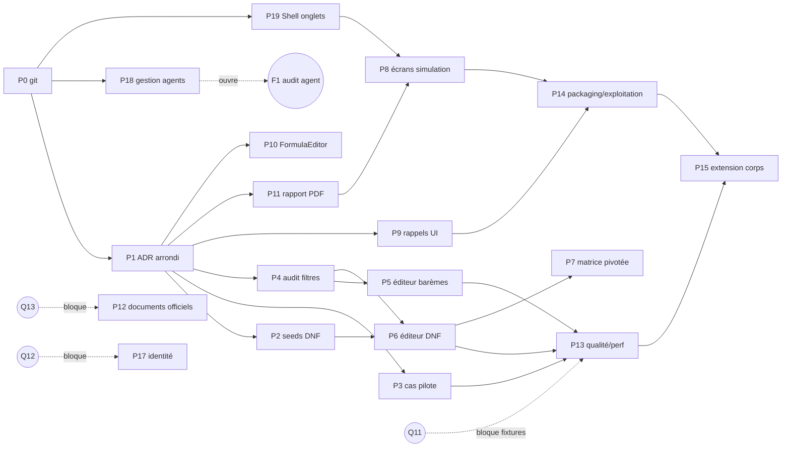

# Plan d'action — Achèvement des chantiers PaieEducation

> **Date :** 19/07/2026. **Base :** audit du 19/07/2026, revérifié intégralement dans le code ce jour (voir « État vérifié » de chaque item).
> **Périmètre :** uniquement les chantiers non finalisés ou non entamés. Les chantiers F1–F13 (finalisés au sens projet) ne sont pas replanifiés ; leur merge vers `main` est couvert par l'item **P0**.
> **Ne remplace pas** `docs/PLAN_ACTION.md` (journal vivant historique des phases 0–10 et des décisions Q1–Q13) : le présent document est le plan d'exécution du reliquat, tracé sur les réfs de l'audit (Fx/Cx/Dx). En cas de divergence, le présent plan fait foi pour l'ordonnancement, `docs/PLAN_ACTION.md` pour les décisions métier.

---

## 0. Écarts constatés entre l'audit fourni et l'état réel du code (revérification du 19/07/2026)

Baseline reconfirmée ce jour : branche `lot-1.1-parametres-strictes`, **12 commits d'avance sur `main`** (`5b0180c`), **aucun remote** ; **593 tests : 592 verts, 1 rouge** (`Arrondi_centralise_uniquement_dans_ArrondiService`, `tests/PaieEducation.Tests.Architecture/DependencyRulesTests.cs`) ; **zéro** `TODO`/`FIXME`/`NotImplementedException` dans `src/` ; **10 fichiers non commités** (8 modifiés + 2 ADR non suivis) — tout est conforme à l'audit. Quatre écarts ou faits nouveaux, en revanche :

1. **É1 — Le contexte d'ADR-0011 est factuellement inexact.** L'ADR affirme « tous les montants circulent en `decimal` natif […] aucun VO `Money` n'est introduit en V1 ». Or le VO **existe et circule** : `src/PaieEducation.Shared/Money/Money.cs`, utilisé par le cœur du pipeline (`CalculationPipeline.cs` l. 95–125 : `BulletinLigne.Montant` est un `Money`), par `RappelCalculator`, `ValidationEngine`, `CumulsAnnuels` (Reporting) et sérialisé via `Infrastructure/Serialization/MoneyJsonConverter.cs` (snapshots V012). La **décision** de l'ADR (pas de généralisation de `Money`, arrondi centralisé) reste défendable, mais son texte doit être corrigé avant commit — sinon l'ADR documente un état du code qui n'existe pas. → intégré à **P1**, avec un choix explicite à trancher (assumer l'état hybride ou résorber le VO).
2. **É2 — ADR-0010 §6 contient une action ouverte non listée par l'audit** : évaluer le renommage `Rubriques.PeriodiciteVersement` → `PeriodiciteService` par migration V015 (+ DTO, ViewModels, `RubriquesV2BaremesSchemaTests`, `ReglementaireSeederTests`), « au plus tard avant la V1-D ». → nouvel item **P16**.
3. **É3 — `RappelRepository` n'a aucun chemin de lecture** (`ExisteAsync` + `EnregistrerAsync` seulement, `src/PaieEducation.Infrastructure/Repositories/Payroll/RappelRepository.cs`). La restitution des rappels dans l'écran bulletin (4c) exige donc d'abord un use case + méthode repo de lecture — l'effort de **P9** en tient compte.
4. **É4 — `RapportImpact` est plus pauvre que ce que l'export PDF (5b) requiert** : le record (`src/PaieEducation.Application/Workbench/UseCases/RapportImpact.cs`) porte 6 champs (NbAgents, deltas min/max/total, période, BulletinsAvertis) mais ni description d'hypothèse, ni horodatage, ni liste d'erreurs — champs exigés par le lot 5.3 du plan d'implémentation. → intégré aux étapes de **P11**.

Réutilisables identifiés lors de la revérification (ils réduisent l'effort estimé des éditeurs) : `ContinuiteTemporelle.Valider` (`src/PaieEducation.Application/Workbench/Services/ContinuiteTemporelle.cs`) et le garde `ValiderContinuite` de `RubriqueRepository.cs` (l. 145, 199) pour **P5** ; `RegleEligibiliteEvaluator` + schéma V009 (`GroupesEligibilite`/`ReglesEligibilite`, FK `CritereId`, `GroupeId` DNF) pour **P6** ; le patron « 1 écran à onglets pour N use cases partageant un repository » (GrilleIndiciaire, 4 onglets) pour **P5/P6** ; l'export PDF/Excel déjà branché dans `ConsulterBulletinViewModel` (commande `ExporterAsync(FormatDocument)`) comme gabarit pour **P11**.

---

## 1. Tableau de synthèse

| Réf | Origine audit | Titre | Priorité | Effort | Dépendances | Blocage externe |
|-----|--------------|-------|----------|--------|-------------|-----------------|
| P0 | D2 | Hygiène git : remote, merge vers `main`, stratégie de branche | **1 — immédiate** | S | aucune | aucun |
| P1 | 3.1 (ADR-0010/0011) + D3 + É1 | Clore le chantier arrondi/Money : refactor `FormulaEvaluator`, corriger ADR-0011, committer les 10 fichiers | **2** | M | P0 (commit propre après merge) | aucun |
| P2 | 3.2 (Lot 1.3) | Externaliser les seeds DNF ISSRP (185 grades) + 4 grades hors catégorie | 3 | M | P1 (baseline verte) | aucun |
| P3 | 3.2 (Lot 2.2) | Compléter et committer formellement le jeu de cas pilote | 3 | M | P1 | aucun |
| P4 | 3.3-d (C3) | Audit : filtres (acteur/action/entité/période) + pagination, lever le `LIMIT 500` | 4 | M | P1 | aucun |
| P5 | 3.3-a (C3) | Éditeur de barèmes (`RubriqueBaremes`) : use cases d'écriture + UI | 5 | L | P1, P4 (audit des écritures) | aucun |
| P6 | 3.3-b (C3) | Éditeur DNF d'éligibilité (`GroupesEligibilite`/`ReglesEligibilite`) : use cases + UI | 6 | L | P2 (format seed unifié), P4 | aucun |
| P7 | 3.3-c (C3) | Matrice de couverture pivotée corps × rubriques, états colorés, drill-down | 7 | M | aucune (P6 enrichit le drill-down) | aucun |
| P8 | 3.4-a (C4) | Écrans manquants : Simulation/Évolution, Génération rappels, Cotisations/IRG ; retrait du placeholder | 8 | L | P1 ; P11 pour le volet « rapport archivable » | aucun |
| P9 | 3.4-c (C4) + É3 | Restitution des rappels dans le parcours bulletin (lecture + UI) | 8 | M | P1 | aucun |
| P10 | 3.4-b (C4) | FormulaEditor avancé (validation live, auto-complétion, simulation agent témoin) | 11 | L | P1 (fonctions d'arrondi stabilisées) | aucun |
| P11 | 3.5-b (C5) | Export PDF du rapport d'impact + archivage AuditLog | 9 | M | P1 ; P4 souhaitable | aucun |
| P12 | 3.5-a (C5) | Documents officiels V1 (attestations, états récap.) | 12 | L | P1 ; cadre extensible déjà prêt (DocumentModelRegistry) | **Q13** |
| P13 | 3.6 (C6) | Qualité : checklist C-T1→C-T6 traçable, tests de performance, fixtures bulletins réels | 10 (partiel) | L | P3, P5, P6 pour C-T ; fixtures : **Q11** | **Q11** (fixtures seulement) |
| P14 | 3.7 (C7) | Packaging Windows, sauvegarde/restauration SQLite, documentation d'exploitation | 13 | L | P1 ; recommandé après P8/P9 pour documenter l'UI réelle | aucun |
| P15 | 3.8 (C8) | Extension aux autres corps (cadre + 1er corps hors enseignants) | 15 — dernière | XL | P13 (pilote validé), P14, P2 | Q11 indirect |
| P16 | É2 (ADR-0010 §6) | Décision + éventuelle migration V015 `PeriodiciteVersement` → `PeriodiciteService` | 14 (décision avant V1-D) | S | aucune (décision) ; M si migration retenue | aucun |
| P17 | D1 | Identité utilisateur (`Actor`) : décision de pérennité du mode autonome | 16 — conditionnel | M–L selon décision | aucune | **Q12** |
| P18 | G1 (audit delta 21/07) | **Gestion des agents** : liste / fiche / édition identité / événement carrière / attributs — livré en `661472c` (22/07/2026) | **1 — déjà livré** | L | aucune en entrée ; **ouvre F1** (audit `AuditLog` des actions agent) en sortie | aucun |
| P19 | G2 (audit delta 21/07) | **Refonte Shell onglets** (`TabViewModel` + `AccueilView` + `TabRequest` + hub Workbench) — livré en `661472c` (22/07/2026) | **1 — déjà livré** | M | aucune en entrée ; **pré-requis à P8-8b/8c** (les sous-lots P8 navigables en onglets) en sortie | aucun |

## 2. Graphe de dépendances global

**Lecture du graphe.** Tout commence par **P0** : chaque jour de travail supplémentaire sur une branche locale sans remote aggrave un risque de perte totale, et chaque nouveau commit creuse l'écart avec `main` — c'est le seul item dont le coût croît en attendant. **P1** vient immédiatement après parce que (a) c'est le seul chantier *ouvert* (10 fichiers non commités qui pollueront tout commit ultérieur), (b) il rétablit la baseline 100 % verte dont tous les autres items ont besoin comme critère de non-régression, et (c) il fige la politique d'arrondi que les éditeurs (P5, P6), le FormulaEditor (P10) et le reporting consommeront. Le trio **P2/P3/P4** verrouille ensuite les fondations (seed data-driven, couverture pilote, traçabilité) *avant* d'ouvrir les chantiers d'écriture Workbench **P5/P6** — on ne construit pas des éditeurs qui écrivent en base avant que l'audit sache filtrer ce qu'ils écriront (P4), ni un éditeur DNF avant que le format de données DNF soit unifié côté seed (P2). **P7–P11** sont largement parallélisables ensuite. **P13** ne peut conclure qu'après les éditeurs (critères C-T1→C-T6 portent sur eux) ; **P14** ferme le cycle produit ; **P15** vient en dernier par construction (pilote validé + processus d'exploitation en place). **P12** et **P17** sont plafonnés par Q13/Q12 ; **P16** est une décision courte à caser avant la validation finale.

---

## 3. Items du plan

### [P0 / D2] Hygiène git : remote, merge vers `main`, stratégie de branche

- **État vérifié** : `git branch -a` → 2 branches locales seulement ; `git remote -v` → vide ; `main` = `5b0180c` (« WIP: snapshot avant Lot 1.1 ») ; `git rev-list --count main..lot-1.1-parametres-strictes` = 12. Aucune sauvegarde hors du disque local.
- **Écart à combler** : historique récent (Lots 1.1→3.4, Phase 7) non mergé, non répliqué ; un incident disque perd 12 commits + le travail non commité.
- **Étapes** :
  1. Configurer un remote (GitHub privé ou autre) et pousser **les deux branches en l'état** (avant toute autre manipulation, pour sécuriser).
  2. Merger `lot-1.1-parametres-strictes` dans `main` (fast-forward impossible : `main` est l'ancêtre direct, donc en réalité **fast-forward possible et recommandé** — vérifier avec `git merge-base` ; sinon merge commit descriptif).
  3. Pousser `main` ; définir la règle de travail : une branche courte par item Px, merge dans `main` à chaque item clos (critères d'acceptation atteints).
  4. Optionnel : taguer l'état mergé (`v0-pilote-moteur`) comme point de référence de l'audit du 19/07.
- **Dépendances** : aucune. **Attention** : ne pas committer les 10 fichiers en cours dans le commit de merge — les laisser dans l'arbre de travail (ils appartiennent à P1) ou les mettre de côté (`git stash`) le temps du merge.
- **Blocage externe** : aucun (le choix de l'hébergeur du remote revient à l'utilisateur, mais un dépôt local nu sur un second disque fait déjà mieux que rien).
- **Critères d'acceptation** : `git remote -v` non vide ; `main` == tête de la branche de travail ; les 2 branches poussées ; règle de branche documentée (README ou CONVENTIONS).
- **Effort estimé** : **S** — aucune écriture de code, opérations git standard sur un historique propre.
- **Risques** : fichiers non commités emportés par erreur dans le merge (parade : stash) ; choix d'hébergement retardé — ne pas laisser ce point bloquer, un remote local est un premier filet acceptable.

### [P1 / 3.1 + D3 + É1] Clore le chantier ADR-0010/0011 : refactor arrondi, correction ADR, commit

- **État vérifié** : garde d'architecture ajouté (diff de `DependencyRulesTests.cs` : +87 lignes, regex sur `Math.Round|decimal.Round|Math.Floor|Math.Ceiling|Math.Truncate` dans `Domain`+`Application`, seul `ArrondiService.cs` exempté) ; il échoue sur `FormulaEvaluator.cs` l. 92 (`Math.Truncate`, *validation d'intégrité* d'un argument, pas un arrondi monétaire) et l. 96 (`Math.Round(x, decimales, AwayFromZero)`, implémentation de la fonction de formule `round(x[, n])`). `ArrondiService` (l. 52–58) ne couvre que 3 modes (dinar/dizaine/centime), **pas** l'arrondi à n décimales arbitraires. ADR-0011 marqué « Accepté — validé par l'utilisateur », ADR-0010 « Proposé ». É1 : le contexte d'ADR-0011 contredit le code (`Money` utilisé dans le pipeline). D3 : commentaire obsolète « pas d'IUnitOfWork » dans `AppliquerEvolutionReglementaire.cs` l. 33–39 alors que le code utilise `_uow` (l. 112–139).
- **Écart à combler** : 1 test rouge ; texte d'ADR inexact ; 10 fichiers à committer ; commentaire obsolète.
- **Étapes** :
  1. **Concevoir le point d'entrée d'arrondi de formule** : ajouter à `ArrondiService` une méthode statique explicite (ex. `ArrondirDecimales(decimal x, int n)` encapsulant `Math.Round(..., AwayFromZero)`) — le fichier est exempté par le garde, la sémantique reste centralisée. Décision à consigner en une ligne dans ADR-0011 (la fonction de formule `round()` délègue à `ArrondiService`).
  2. Remplacer l. 96 de `FormulaEvaluator.cs` par l'appel à ce point d'entrée ; remplacer le `Math.Truncate` de la validation l. 92 par un test sans fonction interdite (ex. `n.Value % 1m != 0m`).
  3. Relancer la suite : 593/593 verts attendus (les tests `FormulaEngineTests` couvrent déjà `round()` — vérifier qu'aucun résultat ne change : le comportement doit être strictement identique).
  4. **Corriger le contexte d'ADR-0011 (É1)** : documenter l'état réel (VO `Money` présent dans `Shared`, porté par `BulletinLigne.Montant` et sérialisé par `MoneyJsonConverter`) et trancher *dans le texte* : soit « état hybride assumé : `Money` reste un porteur passif interne au pipeline, interdiction de l'étendre aux API publiques », soit planifier sa résorption (déconseillé : toucherait les snapshots V012, contraire à ADR-0008). Ne pas committer un ADR dont le « Contexte » est démenti par le code qu'il accompagne.
  5. Corriger le commentaire obsolète d'`AppliquerEvolutionReglementaire.cs` (D3) — une ligne, même commit.
  6. Committer l'ensemble (2 commits proposés : « ADR-0010/0011 + docs » puis « refactor arrondi FormulaEvaluator + garde archi » — ou l'inverse si l'on veut que le garde n'entre jamais rouge dans l'historique : refactor d'abord, garde ensuite).
  7. Statuer sur ADR-0010 : passer de « Proposé » à « Accepté » si l'utilisateur confirme (la liste d'actions §6 est déjà cochée sauf V015 → P16).
- **Dépendances** : P0 (merger avant de committer du neuf).
- **Blocage externe** : aucun (ADR-0011 déjà validé utilisateur ; le passage d'ADR-0010 à « Accepté » demande une confirmation de forme).
- **Critères d'acceptation** : 593/593 verts ; `git status` propre ; ADR-0011 sans contradiction avec le code ; D3 corrigé ; résultats de calcul inchangés (aucun snapshot/fixture modifié).
- **Effort estimé** : **M** — le refactor est petit (2 lignes + 1 méthode), mais la correction d'ADR exige une décision rédigée proprement et une vérification de non-régression sérieuse sur les formules.
- **Risques** : changer subtilement la sémantique de `round()` dans les formules seedées (parade : critère « aucun résultat ne change ») ; laisser passer l'incohérence É1 et devoir ré-amender l'ADR plus tard.

### [P2 / 3.2 — Lot 1.3 reliquat] Externaliser les seeds DNF ISSRP

- **État vérifié** : `ReglementaireSeeder.cs` l. 63–118 : 4 tableaux C# (`Issrp45DirectGrades` 50 grades, `IssrpOrigineGrades` 7, `Issrp30DirectGrades` 20, `Issrp15DirectGrades` 15) + constantes de périodes/sources l. 63–68 ; le report est explicitement documenté l. 31–36. Le reste (rubriques, barèmes, cotisations, paramètres, IRG, formules) lit déjà `Donnees/*.json` avec hash/drift (pattern `ReglementaireJsonDataReader`, testé par `ReglementaireJsonDataReaderTests`).
- **Écart à combler** : dernières valeurs réglementaires en dur ; l'éditeur DNF (P6) manipulera ces mêmes structures — un format de données unique doit préexister.
- **Étapes** :
  1. Définir le format JSON (proposition : `Donnees/Reglementaire/groupes_dnf_issrp_v1.json` — groupes avec sévérité/message/périodes + listes de grades + règles conditionnelles ORIGINE_STATUTAIRE), aligné sur les colonnes réelles de V009 (`GroupesEligibilite`, `ReglesEligibilite.GroupeId/CritereId/Operateur/Valeur`).
  2. Y déplacer les 4 tableaux + les 4 grades hors catégorie (`InsertGradesHorsCategorieAsync`), avec `Source`, `Hash`, `DateEffet`/`DateFin` par ligne (périodes 2008–2024 / 2025+ actuelles).
  3. Adapter `ReglementaireSeeder` en lecteur pur ; conserver l'idempotence (`INSERT OR IGNORE`).
  4. Tests : relecture du JSON (drift hash), idempotence, et surtout **égalité stricte du contenu seedé avant/après** (dump SQL comparé) — le seed ISSRP 185/185 est un acquis validé ligne à ligne, il ne doit pas bouger d'un octet.
- **Dépendances** : P1 (baseline verte). Précède idéalement P6.
- **Blocage externe** : aucun.
- **Critères d'acceptation** : plus aucun ID de grade ni taux dans `ReglementaireSeeder.cs` (hors identifiants techniques) ; `ReglementaireSeederTests` + nouveau test d'équivalence verts ; note l. 31–36 mise à jour.
- **Effort estimé** : **M** — mécanique mais volumineux (185 grades × périodes), et le test d'équivalence exige du soin.
- **Risques** : erreur de transcription silencieuse (parade : test d'équivalence du contenu seedé) ; encodage des IDs accentués (`DDÈP-G032` — attention UTF-8).

### [P3 / 3.2 — Lot 2.2] Compléter et clore formellement le jeu de cas pilote

- **État vérifié** : `BulletinEndToEndTests.cs` : 4 scénarios (bout-en-bout base, hors groupe ISSRP, grade conditionnel origine ENSEIGNANT, agent réel seedé). Manquent, par rapport au lot 2.2 du plan d'implémentation : agent **sans note** (abstention PAPP — la mécanique existe : `CalculEntreeResolver.cs` l. 21, ADR-0009), cotisations vérifiées isolément ligne à ligne, scénario IRG 2022 dédié (tranches + lissage), non-régression des **explications** et du **journal d'audit** du calcul. Aucun commit estampillé « Lot 2.2 ».
- **Écart à combler** : couverture pilote non exhaustive, pas de clôture formelle.
- **Étapes** :
  1. Lister les rubriques du bulletin pilote et les scénarios cibles (matrice scénario × rubrique × assertion) dans `docs/analysis/` (hypothèses restantes documentées — exigence du lot).
  2. Ajouter les scénarios manquants dans `BulletinEndToEndTests` (ou fichier jumeau) : sans note, ISSRP direct vs origine AUTRE et INCONNU (abstention), cotisations isolées, IRG 2022 avec cas de lissage aux bornes.
  3. Ajouter la non-régression des explications (`ExplainabilityPanel`/moteur d'explicabilité) et de l'audit de calcul : assertions sur le contenu, pas seulement sur le net.
  4. Committer sous le libellé « Lot 2.2 » avec renvoi au doc d'analyse.
- **Dépendances** : P1.
- **Blocage externe** : aucun — ne pas confondre avec Q11 : ici il s'agit de scénarios *synthétiques* exhaustifs ; la confrontation aux bulletins *réels* est P13.
- **Critères d'acceptation** : chaque ligne du bulletin pilote prouvée par au moins un test avec explication vérifiée ; doc d'hypothèses en `docs/analysis/` ; commit dédié.
- **Effort estimé** : **M** — l'infrastructure de test e2e existe, c'est de l'extension de couverture, pas de la construction.
- **Risques** : découvrir un écart de calcul réel en écrivant les assertions ligne à ligne (ce serait une *trouvaille*, pas un risque projet — la traiter comme anomalie séparée).

### [P4 / 3.3-d] Audit : filtres et pagination

- **État vérifié** : `AuditLogRepository.ListerAsync(CancellationToken)` sans aucun paramètre, `LIMIT 500` en dur (l. 52–58) ; use case `ListerAuditLog` et `AuditLogViewModel` alignés sur cette signature ; aucune colonne manquante en base (acteur/action/entité/horodatage existent — seules la requête et l'UI sont limitées).
- **Écart à combler** : audit inconsultable au-delà de 500 entrées, aucun filtre.
- **Étapes** :
  1. Introduire un record de critères (`FiltreAuditLog` : acteur?, action?, typeEntité?, période?, curseur/page, taille de page plafonnée) et une surcharge `ListerAsync(FiltreAuditLog, ct)` — garder l'existante en délégation pour ne pas casser les appels.
  2. Requête SQL paramétrée (index existants à vérifier ; ajouter au besoin un index sur `(Timestamp)` via migration Vnnn si le plan de requête l'exige).
  3. Étendre `ListerAuditLog` (use case) puis `AuditLogViewModel`/vue : champs de filtre + pagination (patron « chargement incrémental » simple : bouton « charger plus » suffit en V1, pas de virtualisation complexe).
  4. Tests : repository (filtres combinés, bornes de période, pagination stable par tri déterministe `Timestamp DESC, Id`), ViewModel (états filtrés/vides).
- **Dépendances** : P1. À faire **avant** P5/P6 : les éditeurs multiplieront les écritures d'audit.
- **Blocage externe** : aucun.
- **Critères d'acceptation** : plus de plafond silencieux ; filtres exploitables depuis l'UI ; `ListerAuditLogTests` + `AuditLogViewModelTests` étendus verts.
- **Effort estimé** : **M** — chaîne complète repo→use case→VM→vue, mais sur un patron déjà rôdé 11 fois.
- **Risques** : pagination instable si tri non déterministe (imposer la clé secondaire `Id`).

### [P5 / 3.3-a] Éditeur de barèmes (`RubriqueBaremes`)

- **État vérifié** : table `RubriqueBaremes` (V008 l. 74–92 : `Dimension` CHECK 5 valeurs, bornes TEXT, `TypeValeur` TAUX/MONTANT, `Valeur` canonique, périodes, `Hash`, index unique `(RubriqueId, Dimension, BorneInf, DateEffet)`). **Lecture seule aujourd'hui** : résolution via `BaremeResolver` (Domain), chargement par `PayrollReadRepository`, overrides de simulation (J5M) — aucun use case d'écriture (`Application/Referentiels/UseCases/` couvre rubrique/formule/paramètre/grille/VPI, pas les barèmes), aucune UI. Réutilisables : `ContinuiteTemporelle.Valider` (Application) et le garde de continuité de `RubriqueRepository` (l. 145, 199) ; patron transactionnel `IUnitOfWork` + audit d'`AppliquerEvolutionReglementaire` ; patron UI à onglets de `GrilleIndiciaireView`.
- **Écart à combler** : modifier un barème exige aujourd'hui une recompilation ou du SQL manuel — contraire au principe cardinal zéro-hardcoding.
- **Étapes** :
  1. Use case `DefinirBaremeRubrique` (clôture + nouvelle version sur une clé `(RubriqueId, Dimension, BorneInf)`) et `DupliquerBaremes` (clonage d'une version vers une nouvelle période) — mêmes stratégies que `AppliquerEvolutionReglementaire` (réutiliser `StrategieVersionning`).
  2. Garde-fous Domain/Application : pas de chevauchement de périodes, pas de trou, une seule période ouverte par clé, bornes cohérentes (BorneInf ≤ BorneSup, dimension discrète = bornes égales), `Valeur` parsable par le moteur (valider avec le parseur canonique existant), `Hash` recalculé.
  3. Repository d'écriture (`RubriqueBaremeRepository`) transactionnel via `IUnitOfWork`, avec ligne d'audit systématique (pattern P4 disponible pour la consulter).
  4. UI : onglet(s) sur la fiche/édition de rubrique (réutiliser `EditerRubriqueView` ou l'écran à onglets type GrilleIndiciaire) : grille des versions par dimension, création guidée, duplication.
  5. Tests : unitaires continuité/garde-fous, intégration édition → base → **recalcul** (un bulletin consommant le barème modifié change comme attendu, un bulletin antérieur ne change pas), ViewModel.
- **Dépendances** : P1 ; P4 (traçabilité des écritures) recommandée avant.
- **Blocage externe** : aucun.
- **Critères d'acceptation** : critère du plan d'implémentation repris tel quel — « l'utilisateur modifie un barème sans recompilation ; le calcul suivant consomme la nouvelle version » ; suite verte ; audit enregistré pour chaque écriture.
- **Effort estimé** : **L** — premier chemin d'écriture sur une table à clé composite multi-dimensions ; les garde-fous temporels sont la vraie difficulté, partiellement mitigée par `ContinuiteTemporelle` existant.
- **Risques** : règles de continuité sur clé composite (chevauchements par dimension *et* par borne) plus subtiles que sur la VPI ; cohérence avec les overrides de simulation J5M (l'éditeur et le simulateur doivent partager la même sémantique de résolution).

### [P6 / 3.3-b] Éditeur DNF d'éligibilité

- **État vérifié** : schéma V009 complet (l. 82–135 : `GroupesEligibilite` avec sévérité/message/priorité/périodes ; `ReglesEligibilite` avec `CritereId` FK, `GroupeId` nullable = condition commune, opérateurs `=`/`IN`/`NOT_IN`/comparaisons) ; évaluation entièrement livrée (`RegleEligibiliteEvaluator`, 256 lignes, sémantique « critère non résolu = condition non satisfaite + détail explicable ») et consommée par `SuggererRubriques`. **Aucune écriture** : ni use case, ni repository d'écriture, ni UI (lecture via `ConsulterFicheRubrique` seulement).
- **Écart à combler** : impossible de créer/fermer/versionner une règle DNF sans SQL manuel — les évolutions réglementaires 2025+ (D.ex. 25-55) l'exigeront.
- **Étapes** :
  1. Use cases : `DefinirGroupeEligibilite` (création/clôture versionnée, sévérité, message), `DefinirRegleEligibilite` (condition dans un groupe ou commune : critère + opérateur + valeur + période), suppression logique par clôture de période (jamais de DELETE — cohérent ADR-0008).
  2. Validations : critère existant (`CriteresEligibilite`), opérateur compatible avec le type du critère, valeur parsable (liste pour IN/NOT_IN), périodes continues par groupe, cohérence groupe↔rubrique.
  3. Repository d'écriture transactionnel + audit (même patron que P5).
  4. UI : depuis `FicheRubriqueView` (les groupes y sont déjà affichés — ajouter édition) : groupes OU, conditions ET, sévérité/message ; formulaire de condition avec sélecteurs alimentés par `CriteresEligibilite` (pas de saisie libre — convention zéro-hardcoding).
  5. Tests : unitaires validation, intégration ronde complète « créer règle → `SuggererRubriques` la voit » (critère du plan), cas ISSRP 45/30/15 et origine statutaire rejoués sur des règles créées par l'éditeur.
- **Dépendances** : P2 (le format externe des groupes DNF doit être stabilisé d'abord — sinon l'éditeur et le seed divergent), P4.
- **Blocage externe** : aucun.
- **Critères d'acceptation** : « une règle DNF peut être créée/fermée/versionnée puis vérifiée par `SuggererRubriques` » (critère du plan) ; scénarios ISSRP reproduits via l'éditeur ; suite verte.
- **Effort estimé** : **L** — deux tables liées, sémantique DNF, UI de composition ; l'évaluateur existant sert d'oracle de test, ce qui sécurise beaucoup.
- **Risques** : UI de composition ET/OU peu lisible (mitigation : reprendre la présentation par groupes déjà rendue dans FicheRubrique) ; écriture qui casse une suggestion existante (l'oracle `SuggererRubriques` en test d'intégration couvre ce risque).

### [P7 / 3.3-c] Matrice de couverture pivotée

- **État vérifié** : `ListerMatriceCouverture` renvoie des `CelluleCouverture(CorpsId, RubriqueId, Couverte, Active)` plates ; `MatriceCouvertureView` = DataGrid plat (choix historique validé avec l'utilisateur, la grille pivotée avait été écartée pour risque de binding invérifiable) ; données au grain GRADE côté ISSRP (jamais CORPS — constat mémoire du 17/07 confirmé par le seed).
- **Écart à combler** : lecture de validation admin difficile sur liste plate ; pas d'états intermédiaires (vert/orange/rouge/gris) ni de drill-down.
- **Étapes** :
  1. Enrichir le use case : état par cellule (couverte active / couverte inactive / non couverte / non applicable) — la logique est déjà presque là (`Couverte`×`Active`), formaliser le 4-états.
  2. Pivoter côté **ViewModel** (colonnes générées dynamiquement par rubrique), pas côté SQL — garder le use case plat et testable.
  3. Drill-down : navigation cellule → `FicheRubriqueView` préchargée (le service de navigation ViewModel-first le permet ; ajouter un paramètre de navigation si absent).
  4. Filtres simples (corps, rubrique, état) avant le pivot.
  5. Tests ViewModel : pivot correct sur jeu réduit, navigation, filtres. Revalider le choix pivoté avec l'utilisateur sur maquette avant d'implémenter (le DataGrid plat avait été *choisi* — c'est un revirement à confirmer, pas un oubli).
- **Dépendances** : aucune stricte ; après P6, le drill-down peut pointer vers l'édition des règles.
- **Blocage externe** : aucun formellement, mais **confirmation utilisateur recommandée** (revirement d'un choix UI validé).
- **Critères d'acceptation** : matrice corps×rubriques lisible avec 4 états, drill-down opérationnel, tests VM verts.
- **Effort estimé** : **M** — le risque de binding identifié historiquement se contourne par génération de colonnes en code-behind testée via VM.
- **Risques** : lisibilité à ~180 grades si l'axe choisi est le grade et non le corps (trancher l'axe d'agrégation avec l'utilisateur) ; régression du choix UI antérieur sans validation.

### [P8 / 3.4-a] Écrans manquants : Simulation/Évolution, Rappels, Cotisations/IRG

- **État vérifié** : zéro référence à `SimulerEvolutionReglementaire`, `AppliquerEvolutionReglementaire`, `GenererRappels` dans `src/PaieEducation.Presentation` (grep) ; menu Workbench → `WorkbenchPlaceholderViewModel` (`ShellViewModel.cs` l. 49) ; aucun écran Cotisations/Fiscalité. Les 3 use cases sont finis et testés côté Application — c'est un chantier purement Presentation.
- **Écart à combler** : le cycle réglementaire complet (simuler → consulter l'impact → committer avec audit → générer les rappels) n'est exécutable que par des tests, pas par l'utilisateur.
- **Étapes** (découper en 3 sous-lots livrables séparément) :
  1. **8a — Assistant d'évolution réglementaire** (le plus gros) : écran en étapes — saisie de l'hypothèse (VPI, barème, paramètre : les 3 overrides existent), lancement du dry-run (`SimulerEvolutionReglementaire` chemin full), affichage du `RapportImpact` (deltas, BulletinsAvertis), puis commit via `AppliquerEvolutionReglementaire` (avec saisie de la raison si bypass). Remplacer le placeholder du menu.
  2. **8b — Écran Génération de rappels** : sélection agent/période d'origine, appel `GenererRappels`, restitution des lignes générées (complémentaire de P9 qui les affiche côté bulletin).
  3. **8c — Écrans Cotisations et Fiscalité IRG** : lecture d'abord (barèmes IRG par période, cotisations et taux — les repositories de lecture existent), édition ensuite si P5 a établi le patron (l'IRG est structuré en tranches versionnées, l'éditeur de barèmes s'en rapproche).
  4. Tests ViewModel par écran (patron des 34 tests Presentation existants) ; parcours manuel complet documenté (dotnet run) avant clôture.
- **Dépendances** : P1 ; **P11 recommandé avant ou avec 8a** (D8 exige un rapport archivable — committer une évolution depuis l'UI sans pouvoir archiver le rapport affaiblit la traçabilité) ; 8c après P5.
- **Blocage externe** : aucun.
- **Critères d'acceptation** : plus de `WorkbenchPlaceholderView` dans la navigation ; cycle simuler→committer→rappels exécutable intégralement à la souris avec audit consultable (P4) ; tests VM verts.
- **Effort estimé** : **L** — 3 à 4 écrans dont un assistant multi-étapes, sur un patron éprouvé mais avec l'orchestration la plus riche de l'application.
- **Risques** : l'assistant expose la complexité du chemin « full » (population d'agents à fournir : `AgentIdsPourImpact`) — définir une sélection de population simple (tous les agents actifs par défaut) ; risque de laisser 8c s'enliser (le borner à la lecture en V1 si nécessaire).

### [P9 / 3.4-c + É3] Restitution des rappels dans le parcours bulletin

- **État vérifié** : `RappelRepository` = `ExisteAsync` + `EnregistrerAsync` uniquement — **aucune lecture** (É3) ; `ConsulterBulletinViewModel` affiche lignes/explications et exporte PDF/Excel, aucune mention des rappels ; le modèle documentaire V2 du bulletin (Lot 7.2b : cumuls, mentions) n'inclut pas les lignes de rappel.
- **Écart à combler** : les rappels générés (D9) sont invisibles pour l'utilisateur final.
- **Étapes** :
  1. Ajouter `ListerParAgentAsync`/`ListerParBulletinAsync` au repository + use case de lecture (`ListerRappels`), suivant le patron `ConsulterBulletin`.
  2. Afficher dans `ConsulterBulletinView` une section « Rappels rattachés » (période d'origine, delta, évolution source).
  3. Étendre l'export bulletin (modèle documentaire V3 **ou** enrichissement rétro-compatible du V2 — trancher selon la règle de versionnage du `DocumentModelRegistry`) pour inclure les rappels ; les snapshots existants restent intacts (ADR-0008).
  4. Tests : repository, use case, VM, rendu (patron `BulletinPdfRendererIntegrationTests`).
- **Dépendances** : P1. Synergique avec P8-8b (générer) et P9 (voir) — livrables indépendamment.
- **Blocage externe** : aucun.
- **Critères d'acceptation** : un rappel généré est visible à l'écran et dans l'export ; bulletins sans rappel inchangés octet pour octet.
- **Effort estimé** : **M** — chemin de lecture classique + une extension documentaire versionnée.
- **Risques** : versionnage du modèle documentaire (ne pas muter V2 silencieusement — le registre existe précisément pour ça).

### [P10 / 3.4-b] FormulaEditor avancé

- **État vérifié** : `EditerRubriqueViewModel` valide déjà la formule via `FormulaParser` avant soumission (message d'erreur clair, pas d'exception) ; pas de coloration, pas d'auto-complétion, pas de simulation sur agent témoin. Les catalogues nécessaires à l'auto-complétion existent tous en base (rubriques, `SourcesValeur`, fonctions du langage dans `FormulaEvaluator` : round/abs/min/max/bareme/valeursource).
- **Écart à combler** : confort et sécurité de saisie (une formule valide syntaxiquement peut rester sémantiquement fausse — la simulation témoin est le vrai filet).
- **Étapes** :
  1. **Prioriser la simulation sur agent témoin** (valeur métier maximale) : bouton « Tester » qui exécute `CalculerBulletin` sur un agent choisi avec la formule candidate en override — *vérifier qu'un mécanisme d'override de formule existe ; sinon l'ajouter sur le patron exact des overrides J5L/J5M/J5N (VPI/barèmes/paramètres), c'est le 4e axe du même patron*.
  2. Validation live (déjà quasi acquise : brancher le parse sur la frappe avec debounce) + liste des variables/rubriques/fonctions insérables (ComboBox/popup alimentées par les référentiels — pas de saisie libre).
  3. Coloration syntaxique en dernier (AvalonEdit ou TextBlock à runs — choix à documenter en ADR si dépendance externe ajoutée).
  4. Tests VM : formule valide/invalide/variable inconnue/barème absent ; test d'intégration de la simulation témoin.
- **Dépendances** : P1 (sémantique de `round()` figée avant d'outiller sa saisie).
- **Blocage externe** : aucun.
- **Critères d'acceptation** : une formule invalide ne peut pas être sauvegardée (déjà vrai — le rester) ; une formule valide peut être simulée avant commit ; auto-complétion alimentée en base.
- **Effort estimé** : **L** — la simulation témoin implique probablement un 4e axe d'override moteur ; l'éditeur riche est du travail UI substantiel.
- **Risques** : dépendance UI externe (AvalonEdit) à arbitrer ; sur-investir dans la coloration au détriment de la simulation (l'ordre des étapes ci-dessus s'en prémunit).

### [P11 / 3.5-b + É4] Export PDF du rapport d'impact + archivage

- **État vérifié** : `RapportImpact` = 6 champs (É4 : ni hypothèse, ni horodatage, ni erreurs) ; l'infrastructure documentaire est prête (`DocumentModelRegistry`, `IDocumentRenderer`, QuestPDF via `BulletinPdfRenderer` comme gabarit) ; le payload d'audit d'`AppliquerEvolutionReglementaire` sérialise déjà le rapport en JSON — l'archivage *de données* existe, pas le *document*.
- **Écart à combler** : « aucune évolution réglementaire validée sans rapport consultable » (critère du plan) — le rapport n'est ni exportable ni archivé comme document.
- **Étapes** :
  1. Étendre le contrat : soit enrichir `RapportImpact` (description d'hypothèse, horodatage `IClock`, erreurs rencontrées), soit créer un DTO d'export `RapportImpactDocument` qui l'enveloppe avec les métadonnées de la demande — préférer l'enveloppe (ne pas alourdir le record consommé par les tests unitaires existants).
  2. Modèle documentaire + renderer QuestPDF (`RapportImpactDocumentModelV1`) enregistré au `DocumentModelRegistry`.
  3. Use case `ExporterRapportImpact` (patron `ExporterBulletin`) ; référence du fichier exporté ajoutée au payload d'audit lors du commit.
  4. Tests : rendu non vide/contenu textuel attendu (patron smoke tests existants), round-trip dry-run → export → application.
- **Dépendances** : P1 ; consommé par P8-8a (l'assistant offre le bouton d'export).
- **Blocage externe** : aucun.
- **Critères d'acceptation** : un dry-run produit un PDF horodaté reproductible ; le commit référence le rapport dans `AuditLog`.
- **Effort estimé** : **M** — toute l'infrastructure existe, c'est un 2e client du Document Engine.
- **Risques** : faibles ; veiller à ne pas casser les 7 tests unitaires qui construisent des `RapportImpact` si le record est étendu (d'où l'enveloppe).

### [P12 / 3.5-a] Documents officiels V1 — **bloqué Q13**

- **État vérifié** : aucun template, use case ni test hors bulletin ; le `DocumentModelRegistry` (modèles versionnés) et `ADR-0010` (périmètre : « bulletins, attestations, relevés d'émoluments, attestations 60 mois retraite » — liste indicative, PAS une décision Q13) donnent le cadre.
- **Écart à combler** : Phase 7 réduite au bulletin.
- **Étapes planifiables dès maintenant (sans trancher Q13)** :
  1. Préparer la fiche de décision Q13 à soumettre : liste candidate issue d'ADR-0010 et du lot 5.2 (attestation de salaire CNR, attestation de travail, états récapitulatifs, relevé d'émoluments, attestation 60 mois), avec pour chacune : source réglementaire du format, données requises disponibles/manquantes en base.
  2. **— STOP : le reste attend la réponse Q13 —**
  3. (post-Q13) Par document : DTO + modèle documentaire versionné + use case d'export + entrée UI + test de génération nominale — strictement le patron P11.
- **Dépendances** : P11 (2e client du Document Engine → patron consolidé).
- **Blocage externe** : **Q13** — question exacte à poser : « Quels documents officiels la V1 doit-elle produire, dans quel format réglementaire précis (modèle CNR ? en-têtes ? langue ?), et lesquels sont indispensables avant la mise en marche par opposition à ajoutables ensuite ? »
- **Critères d'acceptation** : chaque document retenu par Q13 a template + use case + test + entrée UI.
- **Effort estimé** : **L** (pour 3–5 documents) — linéaire au nombre de documents une fois le patron P11 posé.
- **Risques** : formats réglementaires imprécis (exiger un spécimen par document dans la réponse Q13).

### [P13 / 3.6] Qualité : checklist C-T, performance, bulletins réels — **partiellement bloqué Q11**

- **État vérifié** : aucun test de performance (aucun fichier dédié) ; aucune fixture de bulletin réel ; les critères C-T1→C-T6 de `docs/PLAN_ACTION.md` Phase 8 ne sont tracés nulle part ; 593 tests couvrent l'axe technique, pas la conformité métier chiffrée.
- **Écart à combler** : passer de « tests techniques verts » à « conformité métier prouvée + tenue de charge mesurée ».
- **Étapes** :
  1. **Non bloqué — checklist C-T** : créer `docs/analysis/CHECKLIST_CT.md` mappant chaque critère C-T1→C-T6 vers les tests existants (nom de classe/méthode) ou vers un item Px de ce plan (beaucoup dépendent de P5/P6) ; statut vert/orange/exclu justifié.
  2. **Non bloqué — performance** : projet ou catégorie de tests dédiée (calcul bulletin unitaire ; simulation 200 agents ; lot 500 ; matrice ; audit paginé) avec seuils volontairement lâches d'abord (mesurer avant de fixer), publiés dans un rapport versionné. S'appuyer sur le seed d'agents de démonstration (`DemoAgentSeeder`) pour générer la population.
  3. **Bloqué Q11 — fixtures réelles** : format de fixture prêt à recevoir (entrées agent + attendus ligne à ligne + net + tolérances documentées) ; test de comparaison paramétré ; rapport d'écart par bulletin. **— STOP jusqu'à réception des bulletins —**
- **Dépendances** : P3 (les scénarios synthétiques d'abord), P5/P6 (plusieurs C-T portent sur l'édition Workbench).
- **Blocage externe** : **Q11** — question exacte : « Quand les bulletins réels anonymisés seront-ils disponibles, combien, sur quelles périodes (avant/après 2025 pour couvrir les deux régimes ISSRP), et sous quel format (papier scanné, tableur, saisie manuelle) ? »
- **Critères d'acceptation** : checklist C-T publiée et tenue à jour ; seuils perf mesurés automatiquement ; (post-Q11) chaque bulletin réel reproduit ou écart documenté/validé.
- **Effort estimé** : **L** — la partie perf est M, la checklist S, les fixtures réelles M mais indéterminées tant que Q11 est ouvert.
- **Risques** : variabilité machine sur les seuils (marges larges + tendance plutôt que valeur absolue) ; bulletins réels incomplets ou illisibles (prévoir le champ « tolérance/écart accepté » dès le format de fixture).

### [P14 / 3.7] Packaging, sauvegarde/restauration, documentation d'exploitation

- **État vérifié** : aucun `*.pubxml` ; `appsettings.json` = chaîne de connexion vide (chemin par défaut via `CheminBaseParDefaut()` dans `App.xaml.cs`) ; zéro occurrence de backup/VACUUM/restauration dans `src/` ; TFM `net10.0-windows` ; `docs/` sans guide utilisateur ni procédure d'exploitation ; le démarrage gère déjà migration + seed idempotent + agent démo optionnel (base saine au 1er lancement — acquis F6).
- **Écart à combler** : application non installable, base non sauvegardable, savoir-faire non transmis.
- **Étapes** :
  1. **Packaging** : profil de publication Windows (recommandation : self-contained win-x64, .NET 10 étant récent sur les postes cibles) ; vérifier lancement sur base vierge *et* base existante ; documenter l'emplacement de la base.
  2. **Sauvegarde/restauration** : commande de sauvegarde via l'API de backup SQLite (`SqliteConnection.BackupDatabase` — cohérente à chaud) + restauration avec vérification préalable (version de schéma via table de migrations, `PRAGMA integrity_check`, espace disque) ; entrée UI simple (menu) + use case testé sur base seedée ; attention au mode WAL (fichiers `-wal`/`-shm`).
  3. **Documentation** : guide utilisateur paie (parcours réels de P8/P9 — d'où la recommandation de séquence), procédure de mise à jour réglementaire par le Workbench (P5/P6/P8), guide technique (architecture, DB, tests, release) ; mise à jour `README.md`.
- **Dépendances** : P1 ; rédaction du guide utilisateur après P8/P9 (documenter l'UI finale, pas l'intermédiaire).
- **Blocage externe** : aucun.
- **Critères d'acceptation** : installation reproductible sur machine Windows vierge ; cycle sauvegarde→restauration→réutilisation prouvé par test ; un mainteneur peut installer/seed/tester/sauvegarder d'après la seule documentation.
- **Effort estimé** : **L** — trois natures de travail distinctes (build, code de sauvegarde testé, rédaction), aucune difficile isolément.
- **Risques** : dépendances .NET 10/WPF sur postes cibles (le self-contained les neutralise au prix de la taille) ; sauvegarde WAL incorrecte si faite par copie de fichier naïve (l'API de backup l'évite).

### [P15 / 3.8] Extension aux autres corps — dernier chantier

- **État vérifié** : aucun dossier de spécification par corps, aucune fixture hors enseignants ; le moteur est prêt par construction (Open/Closed prouvé par les 4 axes d'override et le seed data-driven) ; `Cascade_Corps_Grades_30526.csv` couvre déjà les 185 grades tous corps confondus, et la matrice ISSRP les référence déjà — une partie des données « autres corps » est donc déjà en base.
- **Écart à combler** : rien d'instancié ni de validé hors enseignants.
- **Étapes** :
  1. Cadre : gabarit de dossier de spécification par corps (rubriques, barèmes, éligibilités, sources, documents), processus commun données → Workbench → test bulletin → validation.
  2. Priorisation des corps avec l'utilisateur (critère : complétude des sources dans `Reglementation/`).
  3. Premier corps : uniquement données/paramètres via les éditeurs P5/P6 — **tout besoin de modification moteur est un signal d'alarme** à documenter comme écart au modèle d'extension (critère du plan d'implémentation).
  4. Fixtures de validation par corps (format P13 réutilisé).
- **Dépendances** : P13 (pilote validé), P14 (processus d'exploitation), P2/P5/P6 (extension par données uniquement possible).
- **Blocage externe** : Q11 indirect (validation pilote préalable) ; choix du corps prioritaire = décision utilisateur.
- **Critères d'acceptation** : un bulletin hors enseignants calculé sans changement du pipeline ; écarts Open/Closed documentés (idéalement : aucun).
- **Effort estimé** : **XL** — par nature itératif et dépendant de la qualité des sources réglementaires par corps.
- **Risques** : sources documentaires divergentes ou lacunaires ; découverte tardive d'un besoin moteur (le critère « zéro code moteur » du premier corps est justement le test du modèle).

### [P16 / É2 — ADR-0010 §6] Décision V015 : renommage `PeriodiciteVersement` → `PeriodiciteService`

- **État vérifié** : action « 🔲 Suite à donner » dans ADR-0010 §6 : lever l'ambiguïté sémantique par migration V015 (ALTER TABLE + DTO + ViewModels Workbench + `RubriquesV2BaremesSchemaTests` + `ReglementaireSeederTests`), « décision à prendre au plus tard avant la V1-D ». La colonne est exposée dans `EditerRubriqueViewModel` (champ `periodiciteVersement`).
- **Écart à combler** : décision non prise ; l'ambiguïté du nom persiste dans le schéma et l'UI.
- **Étapes** : (1) fiche courte pour/contre (coût réel : 1 migration + ~6 fichiers + 2 suites de tests ; bénéfice : sémantique) soumise à l'utilisateur ; (2) si retenu : migration V015 + renommages, en dehors de tout autre lot (le projet étant hors production, la migration est sans risque de données) ; si rejeté : cocher l'action dans ADR-0010 avec la justification.
- **Dépendances** : aucune ; **à caler avant P13-final/« V1-D »** ; éviter de la faire *pendant* P5/P6 (mêmes fichiers touchés).
- **Blocage externe** : décision utilisateur (simple arbitrage, pas un Q bloquant).
- **Critères d'acceptation** : action §6 d'ADR-0010 cochée dans un sens ou l'autre ; si migration : suite verte, plus aucune occurrence de l'ancien nom.
- **Effort estimé** : **S** (décision) à **M** (si migration retenue) — renommage mécanique bien délimité par les deux suites de tests citées dans l'ADR.
- **Risques** : collision de fichiers avec P5/P6 si mal séquencé.

### [P17 / D1] Identité utilisateur — **bloqué Q12**

- **État vérifié** : aucun mécanisme d'identité ; `Actor` est un paramètre de `Demande` fourni par l'appelant (`AppliquerEvolutionReglementaire`, `AuditLog.EnregistrerAsync`) ; Q12 acte le « mode autonome (sans authentification) en V1, modèle de rôles prévu mais désactivé ». La dette est réelle pour la *valeur probante* de l'audit (l'acteur est déclaratif).
- **Écart à combler** : dépend entièrement de la réponse Q12.
- **Étapes** :
  1. Poser Q12 (question exacte ci-dessous). **— STOP —**
  2. (si « autonome définitif ») : centraliser un `IActorProvider` retournant un acteur configuré (nom du poste/config) au lieu de chaînes passées par chaque écran — petit, honnête, documenté dans un ADR court.
  3. (si « temporaire ») : ADR d'architecture d'identité (locale ? Windows ? rôles ?) puis implémentation — chantier M–L à replanifier à ce moment-là.
- **Dépendances** : aucune ; l'option 2 peut se glisser dans n'importe quel lot Presentation.
- **Blocage externe** : **Q12** — question exacte : « Le mode autonome sans authentification est-il un choix définitif pour la V1 livrée (l'audit enregistrera un acteur déclaratif/configuré), ou faut-il prévoir une identité vérifiée avant la mise en marche ? Si oui, laquelle (compte Windows, login applicatif, rôles J3I) ? »
- **Critères d'acceptation** : selon décision ; au minimum, plus aucune chaîne d'acteur en dur dans les ViewModels.
- **Effort estimé** : **M** (provider centralisé) à **L** (authentification complète).
- **Risques** : sur-ingénierie si Q12 confirme l'autonome ; sous-estimation si rôles J3I réactivés.

### [P18 / G1] Gestion des agents — **déjà livré 22/07/2026 (commit `661472c`)**

> *Addendum rétroactif (audit delta 21/07/2026).* Ce chantier n'était pas listé dans l'audit du 19/07 ; il a été développé en parallèle (puis commité en `661472c` lors de l'exécution de P0, 22/07/2026). Il est ajouté formellement au plan pour traçabilité — aucun travail de code restant.

- **État vérifié** : 100% livré & commité, tests verts (état global : 730/730 au moment de l'addendum).
  - **Domaine** : `src/PaieEducation.Domain/Agents/AgentModifie.cs` (record, événement de modification d'identité), `EvenementCarriere.cs` (record, nouvel événement de carrière pour un agent existant), `Agents/Repositories/IAgentReadRepository.cs` (lecture : `ObtenirAsync`, `ListerSexesAsync`, `ListerSituationsFamilialesAsync`), `IAgentRepository.cs` (écriture : `ModifierAsync`).
  - **Use cases Application** : `ConsulterFicheAgent` (lecture), `ModifierAgent` (écriture identité, valide `Sexe`/`SituationFamiliale` contre référentiel + `Statut` enuméré), `EnregistrerEvenementCarriere` (avancement grade/catégorie/échelon + type contrat + fonction/établissement optionnels, avec continuité temporelle), `DefinirAttributAgent` (attributs dynamiques par agent) — en plus de `CreerAgent` déjà livré antérieurement.
  - **Repositories** : `AgentRepository.cs` (étendu, transaction `BeginTransaction`/`ExecuteAsync`/`Commit` réutilisée du patron Phase 5), `AgentReadRepository.cs` (nouveau, projections `AgentResume`/`AgentDetail`).
  - **UI Presentation** : `ListeAgentsView`/`ViewModel` (liste paginée, navigation drill-down), `FicheAgentView`/`ViewModel` (lecture détaillée + édition), entrées menu Shell `Agents` → `Liste des agents` / `Créer un agent` / `Suggérer des rubriques` (toutes en onglets fermables via P19).
  - **Tests** : 6 tests d'intégration (`ConsulterFicheAgentTests`, `DefinirAttributAgentTests`, `EnregistrerEvenementCarriereTests`, `ModifierAgentTests`, + extensions `AgentReadRepositoryTests`/`AgentRepositoryTests`) + 4 tests Presentation (`ListeAgentsViewModelTests`, `FicheAgentViewModelTests`, + extensions `CreerAgentViewModelTests`).
  - **Total** : ≈ 1 300 lignes de prod + 1 100 lignes de tests.
- **Écart à combler** : aucun code. L'addendum au plan est l'unique dette documentaire.
- **Dette de cohérence à traiter hors P18** : `ModifierAgent` (`src/PaieEducation.Application/Agents/UseCases/ModifierAgent.cs:54`) appelle `_agents.ModifierAsync(...)` **sans** écrire dans `AuditLog` (`grep "AuditLog" src/PaieEducation.Application/Agents` → 0 résultat). Fuite de traçabilité vis-à-vis d'ADR-0010 §2 (auditabilité des évolutions) — à corriger via **F1** (item à créer, voir §5 nouveau).
- **Étapes** : aucune — le chantier est clos.
- **Dépendances** : aucune en entrée. Crée une dépendance **entrante** pour F1 (audit `AuditLog` des actions de gestion agent).
- **Blocage externe** : aucun.
- **Critères d'acceptation** : 5 use cases Application testés bout-en-bout (lecture/écriture identité + lecture/écriture carrière + attributs) ; 2 écrans MVVM navigables depuis le Shell (Liste + Fiche) ; aucun `TODO`/`FIXME`/`NotImplementedException` dans le code ajouté ; 730/730 tests verts ; commit `661472c` poussé vers `origin/main` (22/07/2026).
- **Effort estimé** : **L** (déjà consommé). ≈ 1 300 lignes de prod + 1 100 lignes de tests sur 4 jours (18–21/07/2026).
- **Risques** : dette de traçabilité (F1) — déjà documentée. Sinon, aucun.

### [P19 / G2] Refonte du Shell en architecture à onglets — **déjà livré 22/07/2026 (commit `661472c`)**

> *Addendum rétroactif (audit delta 21/07/2026).* Idem P18 : développé en parallèle, ajouté formellement au plan pour traçabilité. Aucun travail de code restant.

- **État vérifié** : 100% livré & commité (commit `661472c`, même commit que P18 — les deux chantiers partagent un commit car ils sont structurellement couplés : la navigation à onglets est le pré-requis de l'écran Liste agents multi-instance).
  - **Nouveaux types** : `Presentation/Shell/TabViewModel.cs` (modèle d'onglet — `Titre`, `Contenu`, `EstFermable`, action `Fermer`), `Presentation/Navigation/TabRequest.cs` (record `Titre`/`ViewModel` consommé par le Shell).
  - **Nouveaux écrans** : `Presentation/Shell/AccueilView.xaml`/`xaml.cs`/`ViewModel.cs` (écran d'accueil permanent, non fermable, hub de raccourcis vers les fonctions principales).
  - **Navigation étendue** : `INavigationService.OpenTab<T>(string titre)` (ouvre un onglet fermable) + surcharge `NavigateTo<T>(Action<T> configurator)` (drill-down avec pré-configuration, utilisée par P7 pour la matrice de couverture).
  - **ShellViewModel réécrit** : collection `ObservableCollection<TabViewModel> Onglets`, propriété `OngletActif`, méthodes `OuvrirOnglet`/`Fermer`, **11 commandes `[RelayCommand]`** (une par entrée de menu : Calculer/Valider/Consulter bulletin, Liste/Créer agent, Grille indiciaire, Suggérer rubriques, Workbench Vue d'ensemble, Matrice, Audit, Fiche rubrique, Éditer rubrique).
  - **`WorkbenchPlaceholderViewModel` requalifié en hub de navigation actif** : UniformGrid de boutons routant vers Matrice / Fiche / Éditer / Suggérer / Audit (exit le « à venir »). C'est ce qui a remplacé l'item « retrait du placeholder » du P8-8a initial.
- **Écart à combler** : aucun code. Addendum au plan uniquement.
- **Étapes** : aucune — le chantier est clos.
- **Dépendances** : aucune en entrée. **Pré-requis structurel** à P8-8b (écran Génération de rappels) et P8-8c (écrans Cotisations/IRG) : ces sous-lots ne peuvent être livrés qu'en tant qu'onglets fermables du Shell.
- **Blocage externe** : aucun.
- **Critères d'acceptation** : tous les écrans existants (Calculer/Valider/Consulter bulletin, Créer agent, Grille indiciaire, Suggérer rubriques, Workbench) navigables via des onglets fermables ; un onglet `Accueil` permanent ouvert au démarrage ; `WorkbenchPlaceholder` est devenu un hub actif, plus un écran « à venir » ; aucune logique métier en code-behind (MVVM strict) ; tests `ShellViewModelTests` (63 lignes) et `NavigationServiceTests` (49 lignes) verts.
- **Effort estimé** : **M** (déjà consommé). Refonte du Shell, mécanique mais structurante.
- **Risques** : si l'utilisateur final n'aime pas le paradigme « tout en onglets » (vs navigation traditionnelle maître/détail), retour en arrière coûteux — accepté par construction (la nouvelle UX des Workbench l'illustre déjà).

---

## 4. Blocages externes à faire lever (récapitulatif)

| Réf | Question à poser à l'utilisateur (texte exact) | Items bloqués |
|-----|-----------------------------------------------|---------------|
| **Q11** | Quand les bulletins réels anonymisés seront-ils disponibles, combien, sur quelles périodes (avant/après 2025 pour couvrir les deux régimes ISSRP), et sous quel format (scan, tableur, saisie) ? | P13 (fixtures), P15 (indirect) |
| **Q12** | Le mode autonome sans authentification est-il définitif pour la V1 (acteur déclaratif/configuré dans l'audit), ou une identité vérifiée est-elle requise avant mise en marche — et laquelle ? | P17 |
| **Q13** | Quels documents officiels en V1, avec quel format réglementaire précis (spécimen exigé par document), et lesquels sont indispensables avant mise en marche ? | P12 |

Décisions utilisateur plus légères, non bloquantes mais à confirmer en passant : hébergeur du remote (P0, *résolu 22/07* — remote `menour22567` configuré + token), passage d'ADR-0010 à « Accepté » (P1), revirement DataGrid plat → matrice pivotée (P7, *résolu 22/07* — livré), corps prioritaire (P15), arbitrage V015 (P16).

**Addenda rétroactifs (livrés hors audit, formalisés 22/07/2026)** : P18 (gestion agents) et P19 (refonte Shell onglets), tous deux déjà commités en `661472c` et poussés vers `origin/main`. Aucun blocage externe, aucun effort restant. Voir §3 pour le détail.

**Item à créer au plan (F1)** : traçabilité `AuditLog` des actions de gestion agent (Créer/Modifier/ÉvénCarrière/Attribut). Dette ouverte par P18, à intégrer formellement au plan lors du prochain addendum. Effort S, dépend de P0 (committer) + P18 (livré).

## 5. Ordre d'exécution recommandé

**P0 → P1** (sécuriser puis assainir : remote/merge, puis baseline 593/593 verte et arbre de travail propre) **→ P4, P2, P3** (fondations : traçabilité avant écritures, format DNF avant éditeur, couverture pilote formelle) **→ P5 → P6** (les deux éditeurs, cœur du reliquat fonctionnel) **→ P9, P11, P7** (parallélisables) **→ P8** (l'assistant, une fois rapport exportable et rappels visibles) **→ P13** (checklist + perf ; fixtures dès Q11) **→ P10** (confort éditeur) **→ P16** (décision V015 avant validation finale) **→ P12** (dès Q13) **→ P14 → P17** (selon Q12) **→ P15** (extension, en dernier par construction).

> **Note 22/07/2026 (post-P0).** P0, P18 et P19 sont déjà soldés (commits `8a360e1` (P6), `316403b` (P7), `2c5fed2` (P9), `c6f8712` (seeder), `661472c` (P18 + P19), `148ad7a` (hygiène P0), `08451ca` (CONVENTIONS §7.1), tag `v0-pilote-moteur` posé sur `148ad7a`). L'ordre ci-dessus s'applique à ce qu'il **reste** à faire ; les items déjà livrés sont à considérer comme pré-conditions satisfaites. Les seuls points de vigilance pour la suite : (a) **F1** (audit `AuditLog` des actions agent, dette ouverte par P18) ; (b) l'anomalie A1 (doc `FakeAgentSeeder.cs` 29 vs 30) à corriger au prochain commit ; (c) ADR-0010 toujours « Proposé » alors que P1 demandait « Accepté ».

Ce séquencement suit trois principes : (1) le seul item dont le coût *croît* avec le temps (P0) passe premier ; (2) aucun chantier d'écriture en base n'ouvre avant que la traçabilité (P4) et les formats de données (P2) soient en place ; (3) les items bloqués (Q11/Q12/Q13) sont préparés jusqu'à leur point de blocage exact puis mis en attente, sans jamais bloquer le flux principal.
